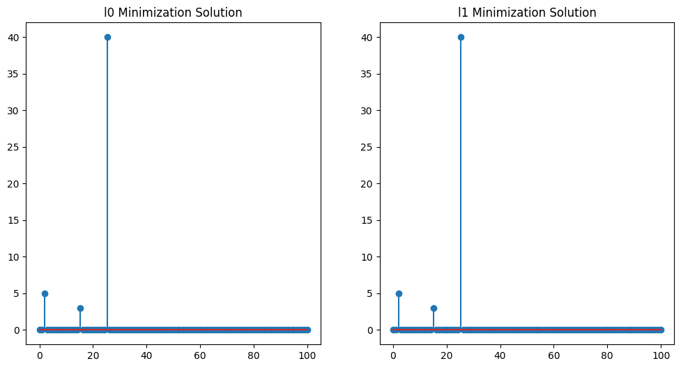
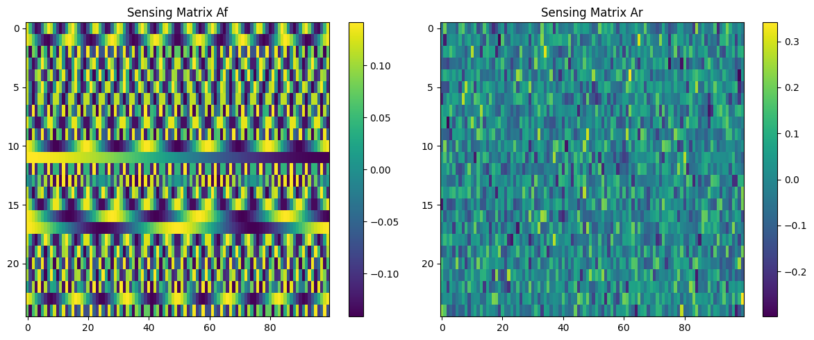
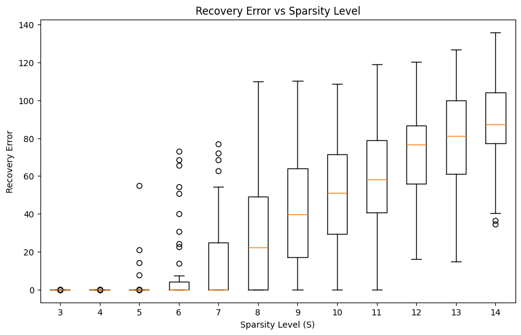

# HW1 — Sparse Recovery via $\ell_0$ and $\ell_1$ Minimization

## Overview

This assignment studies the recovery of a sparse signal from a small number of linear measurements.

The original signal has length $N = 100$, and at most three entries are nonzero. Two sensing matrices are used to generate measurements of the form

$$
y = Ax.
$$

The goal is to recover the unknown sparse signal $x$ from the measurements and compare two recovery strategies:

1. Exhaustive $\ell_0$ minimization
2. $\ell_1$ minimization using linear programming

## What I Implemented

### 1. $\ell_0$ Minimization by Exhaustive Search

The first method searches over all possible supports of size 1, 2, and 3. For each candidate support, the corresponding least-squares problem is solved and checked against the measurement equation.

This directly solves the sparse recovery problem:

$$
\min_x \|x\|_0 \quad \text{subject to} \quad Ax = y.
$$

Although this method can recover the sparse signal correctly for small sparsity levels, it is computationally expensive because the number of possible supports grows combinatorially.

### 2. $\ell_1$ Minimization by Linear Programming

The second method replaces the non-convex $\ell_0$ objective with the convex $\ell_1$ norm:

$$
\min_x \|x\|_1 \quad \text{subject to} \quad Ax = y.
$$

The problem is written as a linear program by decomposing

$$
x = u - v, \qquad u \geq 0, \qquad v \geq 0,
$$

and minimizing

$$
\sum_i (u_i + v_i).
$$

This method recovers the same sparse signal up to numerical precision, while being much faster than exhaustive $\ell_0$ search.

## Key Results

The recovered signal has three nonzero entries:

$$
x_3 = 5, \qquad x_{16} = 3, \qquad x_{26} = 40.
$$

Both $\ell_0$ and $\ell_1$ minimization successfully recover this sparse vector.

The runtime comparison also shows the computational advantage of the convex relaxation:

| Method | Runtime |
|---|---|
| Exhaustive $\ell_0$ search | About 14.5 seconds |
| $\ell_1$ linear programming | About 0.008 seconds |

## Figures

### Sparse Recovery Comparison

  

**Figure 1.** Comparison of the sparse vectors recovered using exhaustive $\ell_0$ minimization and $\ell_1$ minimization. Both methods recover the same three dominant nonzero coefficients.

### Sensing Matrix Structure

  

**Figure 2.** Heatmaps of the two sensing matrices. The matrix $A_f$ has a structured Fourier-like/sinusoidal pattern, while $A_r$ appears random.

### Recovery Error versus Sparsity

  

**Figure 3.** Recovery error as the sparsity level increases. The experiment shows that recovery is reliable for small sparsity levels, but the error increases significantly when the signal becomes less sparse.

## What I Learned

This assignment demonstrates one of the central ideas of compressed sensing: under suitable conditions, a sparse signal can be recovered from far fewer measurements than its ambient dimension.

The main lesson is that direct $\ell_0$ minimization is conceptually simple but computationally infeasible for larger problems, while $\ell_1$ minimization provides an efficient convex relaxation that can recover the same sparse solution in practice.

The sparsity-level experiment also illustrates that recovery quality depends strongly on how sparse the signal is relative to the number of measurements and the structure of the sensing matrix.
