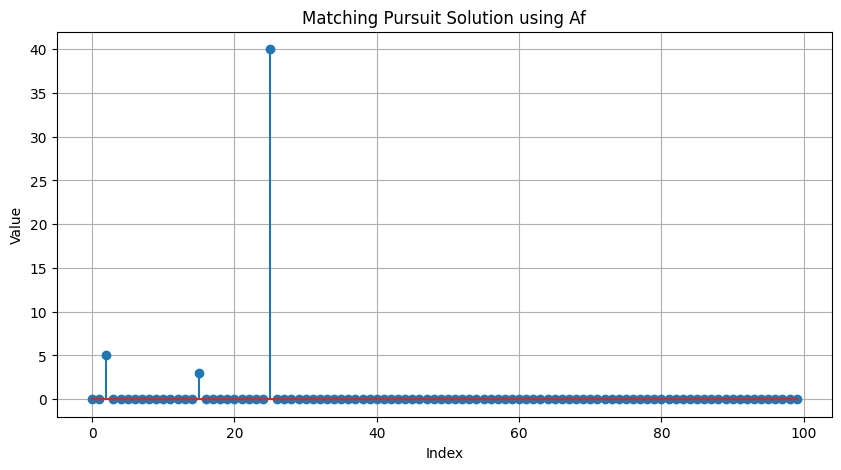
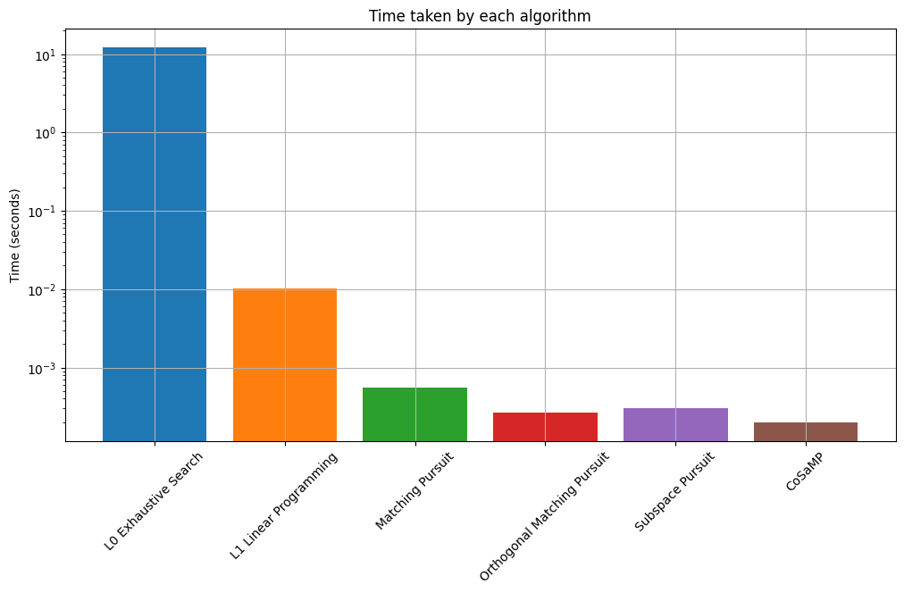
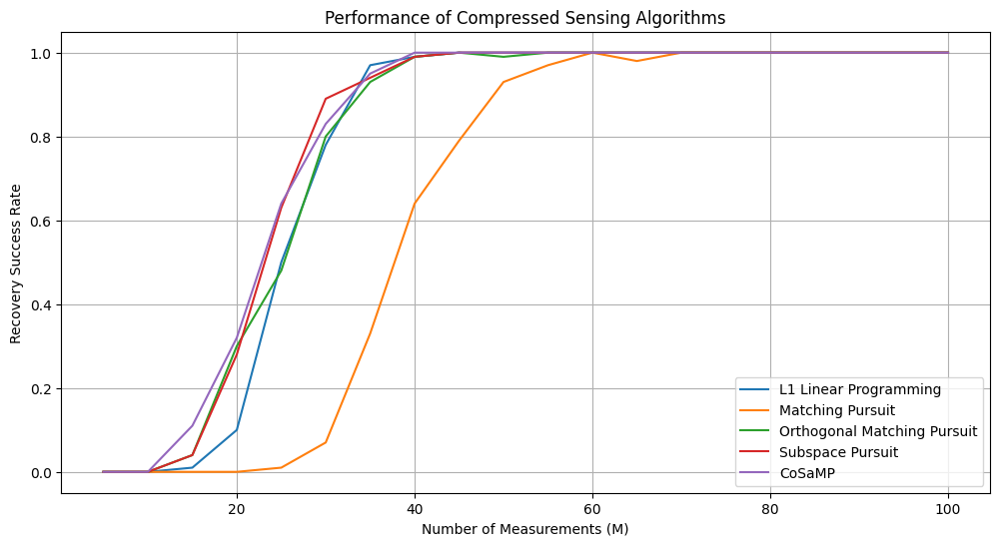

# HW2 — Greedy Pursuit Algorithms for Sparse Recovery

## Overview

This assignment implements and compares several sparse recovery algorithms for compressed sensing.

The first part recovers the sparse signal from HW1 using four greedy pursuit algorithms:

1. Matching Pursuit
2. Orthogonal Matching Pursuit
3. Subspace Pursuit
4. CoSaMP

The second part tests these algorithms on synthetic sparse signals with different numbers of measurements and compares their probability of perfect recovery.

## Problem Setup

The goal is to recover a sparse signal $x$ from linear measurements

$$
y = Ax.
$$

In the HW1 recovery problem, the signal has length $N = 100$ and sparsity $S = 3$.

In the synthetic experiment, the signal has length $N = 256$ and sparsity $S = 5$. The number of measurements $M$ is varied from 5 to 100, and each algorithm is tested over 100 random signal instances.

## What I Implemented

<table>
  <tr>
    <th>Algorithm</th>
    <th>Main Idea</th>
    <th>Support Update</th>
  </tr>
  <tr>
    <td><b>Matching Pursuit</b></td>
    <td>Greedily selects the column most correlated with the residual.</td>
    <td>Adds one selected atom at a time.</td>
  </tr>
  <tr>
    <td><b>Orthogonal Matching Pursuit</b></td>
    <td>Improves MP by recomputing all selected coefficients using least squares.</td>
    <td>Keeps selected atoms and orthogonalizes the residual.</td>
  </tr>
  <tr>
    <td><b>Subspace Pursuit</b></td>
    <td>Builds a candidate support, solves least squares, and prunes back to sparsity level S.</td>
    <td>Can remove previously selected atoms.</td>
  </tr>
  <tr>
    <td><b>CoSaMP</b></td>
    <td>Selects a larger candidate set each iteration to avoid missing true support elements.</td>
    <td>Selects 2S candidates, merges, solves least squares, and prunes to S.</td>
  </tr>
</table>

## Algorithm Details

### Matching Pursuit

Matching Pursuit starts with residual $r = y$ and repeatedly chooses the sensing matrix column that has the largest correlation with the current residual:

$$
j = \arg\max_i |\langle a_i, r \rangle|.
$$

After selecting the column, the coefficient is updated and the contribution of that column is removed from the residual.

### Orthogonal Matching Pursuit

Orthogonal Matching Pursuit also selects columns by correlation, but after each new atom is selected, it recomputes the coefficients on the full selected support using least squares:

$$
\hat{x}_{\mathcal{S}} = \arg\min_z \|y - A_{\mathcal{S}}z\|_2.
$$

This makes the residual orthogonal to the span of the selected columns.

### Subspace Pursuit

Subspace Pursuit keeps a support set of size $S$. At each iteration, it merges the current support with new candidate indices, solves a least-squares problem, and then keeps only the $S$ largest coefficients.

### CoSaMP

CoSaMP is similar to Subspace Pursuit, but it selects $2S$ new candidate indices at each iteration. This makes the algorithm more aggressive in identifying the correct support.

## Key Results

All four greedy algorithms successfully recovered the sparse vector from HW1.

The recovered nonzero entries are:

$$
x_3 = 5, \qquad x_{16} = 3, \qquad x_{26} = 40.
$$

The runtime comparison shows that greedy pursuit methods are much faster than exhaustive search.

<table>
  <tr>
    <th>Method</th>
    <th>Runtime</th>
  </tr>
  <tr>
    <td>ℓ₀ Exhaustive Search</td>
    <td>About 12.2 seconds</td>
  </tr>
  <tr>
    <td>ℓ₁ Linear Programming</td>
    <td>About 0.010 seconds</td>
  </tr>
  <tr>
    <td>Matching Pursuit</td>
    <td>About 0.0005 seconds</td>
  </tr>
  <tr>
    <td>Orthogonal Matching Pursuit</td>
    <td>About 0.0003 seconds</td>
  </tr>
  <tr>
    <td>Subspace Pursuit</td>
    <td>About 0.0003 seconds</td>
  </tr>
  <tr>
    <td>CoSaMP</td>
    <td>About 0.0002 seconds</td>
  </tr>
</table>

## Figures

### Sparse Recovery Using Matching Pursuit

  

**Figure 1.** Sparse signal recovered using Matching Pursuit. The algorithm correctly identifies the three dominant nonzero entries of the signal.

### Runtime Comparison

  

**Figure 2.** Runtime comparison of exhaustive search, ℓ₁ linear programming, and greedy pursuit algorithms. The y-axis is shown on a logarithmic scale to highlight the large runtime gap.

### Recovery Success Rate

  

**Figure 3.** Probability of perfect recovery versus number of measurements $M$ for different sparse recovery algorithms on synthetic signals with $N = 256$ and $S = 5$.

## Key Takeaways

<table>
  <tr>
    <th>Concept</th>
    <th>Main Takeaway</th>
  </tr>
  <tr>
    <td><b>Greedy recovery</b></td>
    <td>Greedy pursuit methods can recover sparse signals very efficiently when the support is identifiable.</td>
  </tr>
  <tr>
    <td><b>MP vs OMP</b></td>
    <td>OMP improves MP by recomputing coefficients over the full selected support.</td>
  </tr>
  <tr>
    <td><b>SP and CoSaMP</b></td>
    <td>These methods can revise the support set, which makes them more flexible than MP and OMP.</td>
  </tr>
  <tr>
    <td><b>Runtime</b></td>
    <td>Greedy methods are much faster than exhaustive ℓ₀ search and faster than ℓ₁ linear programming in this experiment.</td>
  </tr>
  <tr>
    <td><b>Measurements</b></td>
    <td>The recovery probability increases as the number of measurements grows.</td>
  </tr>
</table>

