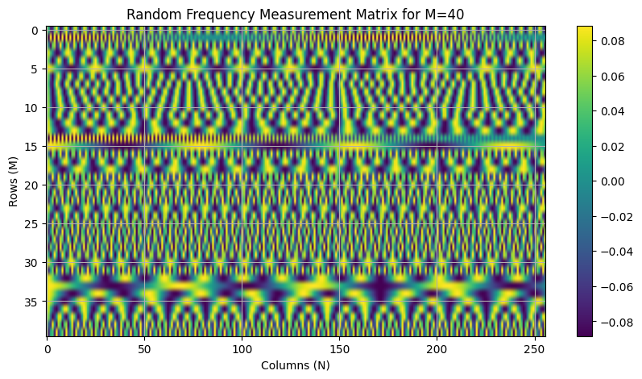
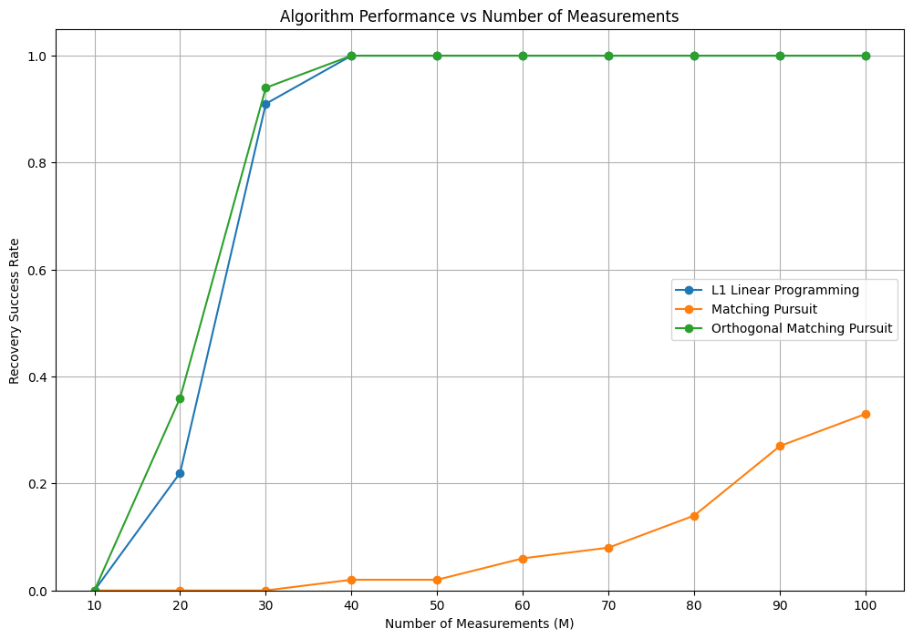
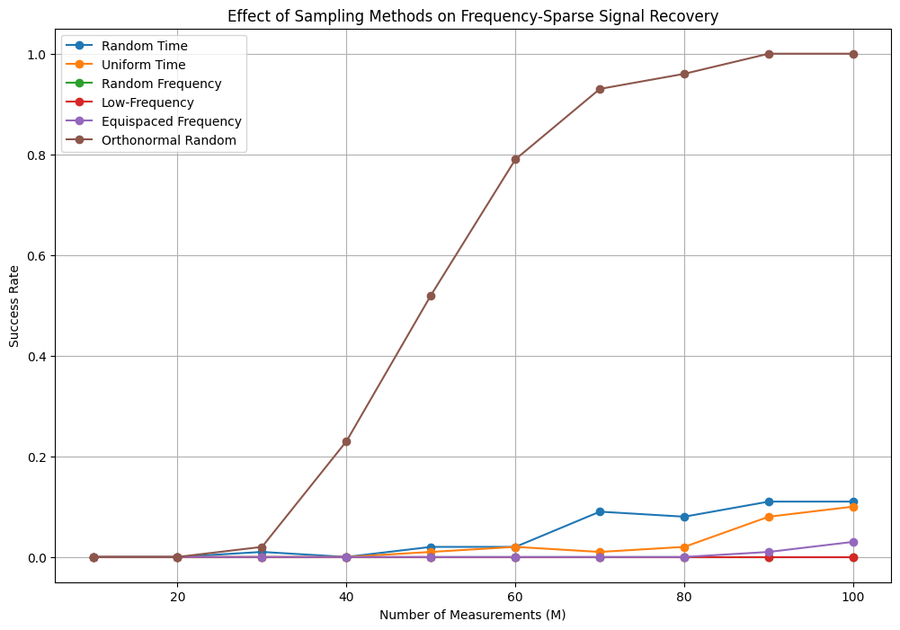
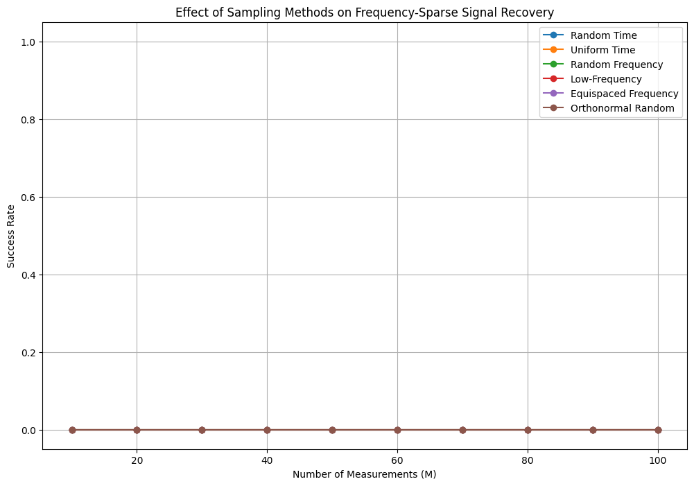

# HW3 — Sparse Recovery with Different Sensing Matrices

## Overview

This assignment studies how the choice of sensing matrix affects sparse signal recovery.

The main goal is to recover sparse signals from compressed measurements

$$
y = Ax,
$$

where $x$ is sparse, $A$ is the sensing matrix, and $y$ is the measurement vector.

In this homework, several sampling strategies are tested, including time-domain sampling, frequency-domain sampling using the DCT matrix, and random orthonormal sensing matrices.

## Problem Setup

For the first experiment, the signal is sparse in the time domain:

$$
N = 256, \qquad S = 5.
$$

The number of measurements is varied as

$$
M \in \{10, 20, 30, \ldots, 100\}.
$$

For each value of $M$, the recovery algorithms are tested on 100 randomly generated sparse signals.

The second experiment repeats the same idea for frequency-sparse signals. In this case, the signal is sparse in the DCT domain:

$$
x = \Psi \alpha,
$$

where $\Psi$ is the inverse DCT basis and $\alpha$ is sparse.

## What I Implemented

### 1. Different Sensing Matrices

<table>
  <tr>
    <th>Sampling Method</th>
    <th>Sensing Matrix Construction</th>
  </tr>
  <tr>
    <td><b>Random time sampling</b></td>
    <td>Randomly selected rows of the identity matrix.</td>
  </tr>
  <tr>
    <td><b>Uniform time sampling</b></td>
    <td>Uniformly spaced rows of the identity matrix.</td>
  </tr>
  <tr>
    <td><b>Random frequency sampling</b></td>
    <td>Randomly selected rows of the DCT matrix.</td>
  </tr>
  <tr>
    <td><b>Low-frequency sampling</b></td>
    <td>The first M rows of the DCT matrix.</td>
  </tr>
  <tr>
    <td><b>Equispaced frequency sampling</b></td>
    <td>Uniformly spaced rows of the DCT matrix.</td>
  </tr>
  <tr>
    <td><b>Orthonormal random sampling</b></td>
    <td>Rows from a Gaussian random matrix after orthonormalization.</td>
  </tr>
</table>

### 2. Sparse Recovery Algorithms

The time-sparse recovery experiments use three algorithms:

<table>
  <tr>
    <th>Algorithm</th>
    <th>Role in the Experiment</th>
  </tr>
  <tr>
    <td><b>ℓ₁ Linear Programming</b></td>
    <td>Convex sparse recovery baseline.</td>
  </tr>
  <tr>
    <td><b>Matching Pursuit</b></td>
    <td>Greedy recovery based on residual correlation.</td>
  </tr>
  <tr>
    <td><b>Orthogonal Matching Pursuit</b></td>
    <td>Greedy recovery with least-squares coefficient updates.</td>
  </tr>
</table>

For frequency-sparse signals, I modified the recovery formulation to recover sparse DCT coefficients instead of directly recovering the time-domain signal.

The frequency-sparse model is

$$
y = A \Psi \alpha,
$$

where $\alpha$ is sparse. After recovering $\alpha$, the signal is reconstructed using the inverse DCT.

## Key Results

For time-sparse signals, direct time-domain subsampling performs poorly because the measurements may miss the nonzero entries of the signal.

Frequency-domain and random orthonormal sensing matrices perform much better. In particular, random frequency sampling and orthonormal random sampling give strong recovery performance when the number of measurements is large enough.

For frequency-sparse signals with $S = 5$, the orthonormal random sensing matrix gives the strongest recovery performance among the tested sampling methods.

When the sparsity level is increased to $S = 25$, recovery becomes much harder and the success rate drops significantly.

## Figures

### Random Frequency Sensing Matrix

  

**Figure 1.** Example sensing matrix constructed by randomly selecting rows from the DCT matrix. This matrix represents random sampling in the frequency domain.

### Time-Sparse Recovery with Random Frequency Sampling

  

**Figure 2.** Recovery success rate versus number of measurements for a time-sparse signal using random frequency sampling. ℓ₁ minimization and OMP achieve high recovery probability with enough measurements.

### Frequency-Sparse Recovery, S = 5

  

**Figure 3.** Effect of different sampling methods on frequency-sparse signal recovery with $S = 5$. The orthonormal random sensing matrix gives the best performance in this experiment.

### Frequency-Sparse Recovery, S = 25

  

**Figure 4.** Frequency-sparse recovery experiment with $S = 25$. Increasing the sparsity level makes the recovery problem much more difficult, and the success rate drops sharply.

## Key Takeaways

<table>
  <tr>
    <th>Concept</th>
    <th>Main Takeaway</th>
  </tr>
  <tr>
    <td><b>Sensing matrix design</b></td>
    <td>The recovery quality depends strongly on how the sensing matrix interacts with the sparsity basis.</td>
  </tr>
  <tr>
    <td><b>Time-domain sampling</b></td>
    <td>Sampling entries directly can fail when the nonzero locations are missed.</td>
  </tr>
  <tr>
    <td><b>Frequency-domain sampling</b></td>
    <td>DCT-based sensing matrices can improve recovery for time-sparse signals.</td>
  </tr>
  <tr>
    <td><b>Random orthonormal sensing</b></td>
    <td>Random orthonormal measurements gave strong performance, especially for frequency-sparse signals with small sparsity.</td>
  </tr>
  <tr>
    <td><b>Sparsity level</b></td>
    <td>Recovery becomes much harder when the sparsity level increases from S = 5 to S = 25.</td>
  </tr>
</table>

