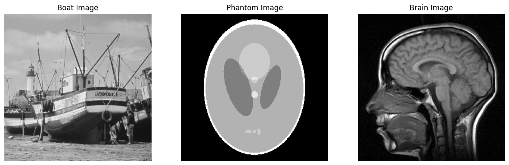
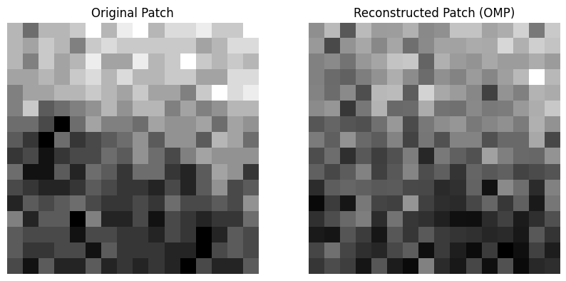
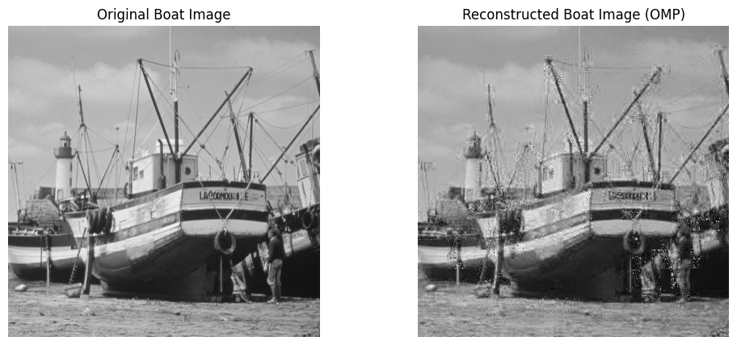
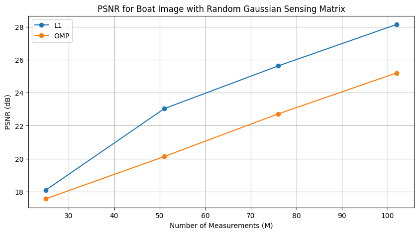
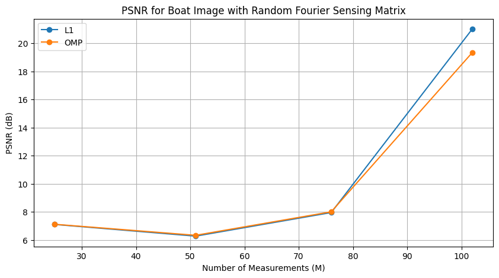

# HW4 — Sparse Image Recovery with Compressed Sensing

## Overview

This assignment applies compressed sensing to image reconstruction.

Unlike the previous homeworks, the signal is now a real image instead of a synthetic sparse vector. Since natural images are not exactly sparse in the pixel domain, each image is divided into small patches and represented using an IDCT sparsifying basis, similar to the idea used in JPEG compression.

The reconstruction problem is based on compressed measurements of the form

$$
y = Ax,
$$

where $A$ is the sensing matrix and $x$ is a vectorized image patch.

## Problem Setup

Three grayscale images are used:

1. Boat image
2. Phantom image
3. Brain image

Each image is divided into patches of size

$$
16 \times 16.
$$

Therefore, each patch is vectorized into a signal of length

$$
N = 16 \times 16 = 256.
$$

The number of measurements is varied as a fraction of the patch dimension:

$$
M \in \{0.1N, 0.2N, 0.3N, 0.4N\}.
$$

For each patch, the sparse representation is recovered in the IDCT domain.

## What I Implemented

### 1. Patch-Based Image Processing

The image is first divided into non-overlapping patches. Each patch is flattened into a vector:

$$
x \in \mathbb{R}^{256}.
$$

After reconstruction, the recovered patches are stitched back together to form the reconstructed image.

### 2. IDCT Sparsifying Basis

The sparse representation is built using the 2D IDCT basis.

For each patch, the model is

$$
x = \Psi \alpha,
$$

where $\Psi$ is the 2D IDCT basis and $\alpha$ contains the transform coefficients.

Instead of recovering the image patch directly, the algorithm recovers the sparse coefficient vector $\alpha$ from

$$
y = A\Psi\alpha.
$$

The effective sensing matrix is therefore

$$
\Theta = A\Psi.
$$

### 3. Sensing Matrices

<table>
  <tr>
    <th>Sensing Scheme</th>
    <th>Description</th>
  </tr>
  <tr>
    <td><b>Random Gaussian</b></td>
    <td>Random measurements generated from a Gaussian matrix and orthonormalized.</td>
  </tr>
  <tr>
    <td><b>Random Fourier / DCT</b></td>
    <td>Measurements generated using randomly selected rows from a frequency-domain transform matrix.</td>
  </tr>
</table>

### 4. Reconstruction Algorithms

The image reconstruction experiments compare two recovery methods:

<table>
  <tr>
    <th>Algorithm</th>
    <th>Role</th>
  </tr>
  <tr>
    <td><b>ℓ₁ Linear Programming</b></td>
    <td>Convex sparse recovery method for estimating IDCT coefficients.</td>
  </tr>
  <tr>
    <td><b>Orthogonal Matching Pursuit</b></td>
    <td>Greedy sparse recovery method based on iterative support selection and least squares.</td>
  </tr>
</table>

## Evaluation Metric

The reconstruction quality is measured using Peak Signal-to-Noise Ratio, or PSNR.

The mean squared error is

$$
\mathrm{MSE} = \frac{1}{N^2}\|\hat{x} - x\|_2^2.
$$

The PSNR is

$$
\mathrm{PSNR} = 10 \log_{10}\left(\frac{\mathrm{MAX}^2}{\mathrm{MSE}}\right),
$$

where $\mathrm{MAX} = 255$ for grayscale images.

Higher PSNR means better reconstruction quality.

## Key Results

The reconstructed Boat image shows that compressed sensing can recover a visually recognizable image from partial measurements.

For the Boat image, using OMP with random Gaussian sensing at approximately $M = 0.3N$ gives a reconstructed image with PSNR around

$$
22.71 \ \mathrm{dB}.
$$

In the PSNR experiments, increasing the number of measurements generally improves reconstruction quality.

For the Boat image, the random Gaussian sensing matrix gives stronger and more stable reconstruction quality than the random Fourier/DCT sensing matrix.

Across the tested cases, ℓ₁ minimization usually gives higher PSNR than OMP, while OMP provides a useful greedy baseline.

## Figures

### Test Images

  

**Figure 1.** The three grayscale test images used in the experiment: Boat, Phantom, and Brain.

### Patch Reconstruction with OMP

  

**Figure 2.** Example reconstruction of a single $16 \times 16$ image patch using OMP. The patch is reconstructed by estimating sparse IDCT-domain coefficients from compressed measurements.

### Full Boat Image Reconstruction

  

**Figure 3.** Original Boat image and reconstructed Boat image using patch-based compressed sensing with OMP.

### PSNR Comparison for Boat Image

<table>
  <tr>
    <td align="center">
      
    </td>
    <td align="center">
      
    </td>
  </tr>
  <tr>
    <td align="center"><b>Random Gaussian sensing</b></td>
    <td align="center"><b>Random Fourier / DCT sensing</b></td>
  </tr>
</table>

**Figure 4.** PSNR versus number of measurements for the Boat image. Random Gaussian sensing gives better reconstruction quality than random Fourier/DCT sensing in this experiment, and ℓ₁ minimization gives higher PSNR than OMP.

## Key Takeaways

<table>
  <tr>
    <th>Concept</th>
    <th>Main Takeaway</th>
  </tr>
  <tr>
    <td><b>Image sparsity</b></td>
    <td>Natural images are not exactly sparse in pixels, but they can be approximately sparse in a transform domain such as IDCT.</td>
  </tr>
  <tr>
    <td><b>Patch-based recovery</b></td>
    <td>Dividing the image into small patches makes compressed sensing reconstruction more practical.</td>
  </tr>
  <tr>
    <td><b>Sensing matrix</b></td>
    <td>The choice of sensing matrix strongly affects reconstruction quality.</td>
  </tr>
  <tr>
    <td><b>Measurement rate</b></td>
    <td>Increasing the number of measurements generally improves PSNR and visual quality.</td>
  </tr>
  <tr>
    <td><b>ℓ₁ vs OMP</b></td>
    <td>ℓ₁ minimization gives better PSNR in these experiments, while OMP provides a faster greedy baseline.</td>
  </tr>
</table>

