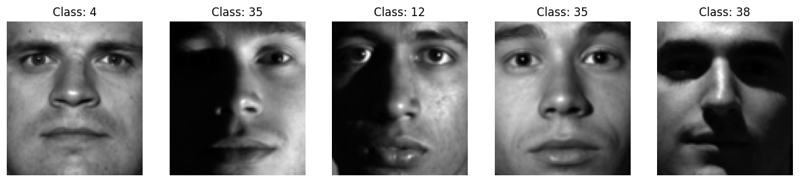
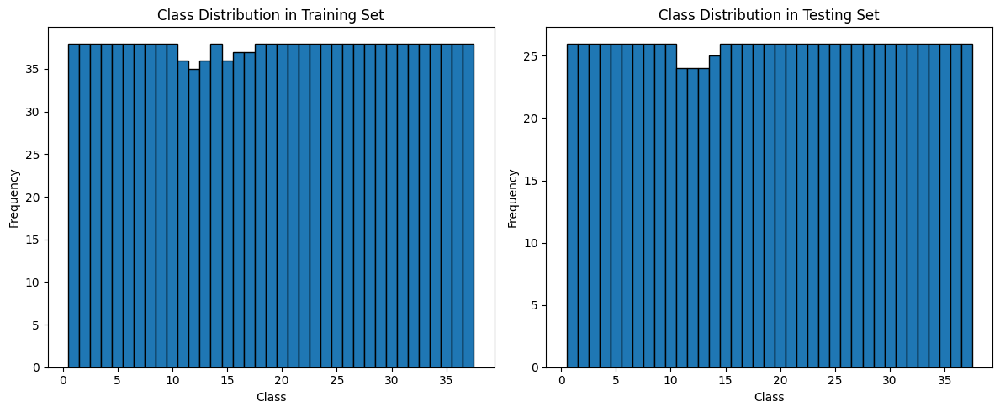
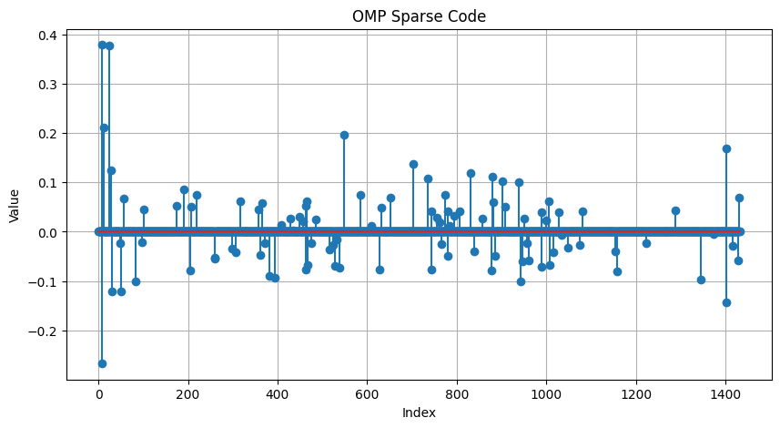
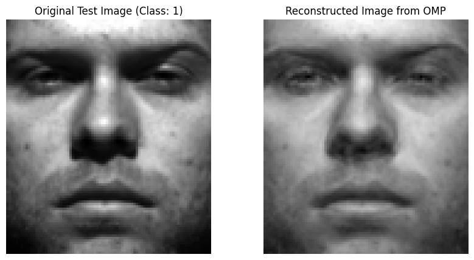
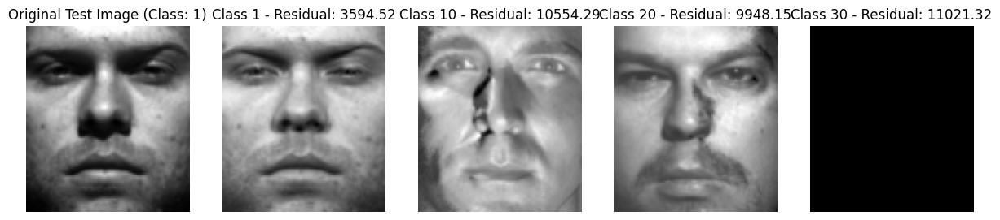
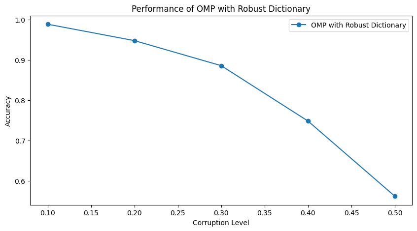

# HW5 — Sparse Representation Classification for Face Recognition

## Overview

This assignment implements a face-recognition algorithm based on **Sparse Representation Classification**, or SRC.

The main idea is that a test face image can be represented as a sparse linear combination of training face images. Ideally, most of the important nonzero coefficients should correspond to training images from the correct subject.

The sparse representation problem is written as

$$
y \approx A\alpha,
$$

where $y$ is the vectorized test image, $A$ is the dictionary of training images, and $\alpha$ is the sparse coefficient vector.

After recovering $\alpha$, the class is predicted by checking which class gives the smallest reconstruction residual.

## Dataset

The experiment uses the cropped version of the **Extended Yale Face Database B**.

The dataset contains face images from 38 human subjects under different illumination conditions. Each cropped face image has size

$$
96 \times 84.
$$

The loaded data contains

$$
2414
$$

face images.

The dataset is split using the provided subset labels:

<table>
  <tr>
    <th>Split</th>
    <th>Subsets Used</th>
    <th>Purpose</th>
  </tr>
  <tr>
    <td><b>Training set</b></td>
    <td>Subsets 0, 1, and 2</td>
    <td>Build the sparse representation dictionary.</td>
  </tr>
  <tr>
    <td><b>Testing set</b></td>
    <td>Subsets 3 and 4</td>
    <td>Evaluate recognition accuracy.</td>
  </tr>
</table>

## What I Implemented

### 1. Dictionary Construction

Each training image is vectorized and used as one column of the dictionary matrix.

If each image has size $96 \times 84$, then each vectorized image has dimension

$$
96 \times 84 = 8064.
$$

The training dictionary is constructed as

$$
A =
\begin{bmatrix}
| & | & & | \\
a_1 & a_2 & \cdots & a_n \\
| & | & & |
\end{bmatrix},
$$

where each column $a_i$ is one training face image.

### 2. Sparse Coding with OMP

For a test image $y$, Orthogonal Matching Pursuit is used to solve the sparse approximation problem

$$
y \approx A\alpha.
$$

The recovered coefficient vector $\alpha$ should ideally be sparse, meaning that only a small number of training images contribute significantly to reconstructing the test image.

### 3. Class Prediction by Residual Error

After computing the sparse code, the coefficients are separated by class.

For each class $c$, only the coefficients belonging to that class are kept, and the image is reconstructed using that class only:

$$
\hat{y}_c = A\delta_c(\alpha),
$$

where $\delta_c(\alpha)$ keeps only the coefficients associated with class $c$.

The residual error for class $c$ is

$$
r_c(y) = \|y - A\delta_c(\alpha)\|_2.
$$

The predicted label is the class with the smallest residual:

$$
\hat{c} = \arg\min_c r_c(y).
$$

### 4. Fast Batched OMP

I also tested a faster batched OMP implementation.

This was a major computational improvement. The batched OMP library was able to run OMP on 981 test images in less than 3 seconds, while my own implementation would have taken hours. Even the scikit-learn OMP implementation would take more than 30 minutes.

## Key Results

For the tested example image, the true class is

$$
c = 1.
$$

The OMP sparse code places several of its important nonzero coefficients on training images from class 1.

The class-wise residual test also predicts

$$
\hat{c} = 1.
$$

Running the OMP-based SRC classifier on the full test set gives the final accuracy

$$
\text{Accuracy} = 0.9959.
$$

The original full test-set evaluation took more than one hour using my implementation, but the batched OMP implementation reduced the runtime to less than 3 seconds.

The robust-dictionary experiment also shows that the classifier remains accurate for small corruption levels, but accuracy decreases as the corruption level increases.

## Runtime Comparison

<table>
  <tr>
    <th>Implementation</th>
    <th>Runtime for 981 Test Images</th>
  </tr>
  <tr>
    <td><b>My OMP implementation</b></td>
    <td>Hours</td>
  </tr>
  <tr>
    <td><b>scikit-learn OMP</b></td>
    <td>More than 30 minutes</td>
  </tr>
  <tr>
    <td><b>Batched OMP library</b></td>
    <td>Less than 3 seconds</td>
  </tr>
</table>

## Figures

### Sample Face Images

  

**Figure 1.** Example face images from the cropped Yale face dataset. The images show different subjects under different illumination conditions.

### Train/Test Class Distribution

  

**Figure 2.** Class distribution in the training and testing sets. The split keeps all 38 classes represented in both sets.

### OMP Sparse Code

  

**Figure 3.** Sparse coefficient vector recovered by OMP for one test image. The nonzero coefficients indicate which training images are used to reconstruct the test face.

### Face Reconstruction from OMP

  

**Figure 4.** Original test face and reconstructed face using the OMP sparse representation. The reconstruction is visually close to the original image.

### Residual Errors for Class Prediction

  

**Figure 5.** Residual error for each class using the OMP sparse code. The class with the smallest residual is selected as the predicted identity.

### Robust Dictionary Performance

  

**Figure 6.** Accuracy of OMP with a robust dictionary under different corruption levels. The method performs very well at low corruption levels, but the accuracy decreases as the corruption level increases.

## Key Takeaways

<table>
  <tr>
    <th>Concept</th>
    <th>Main Takeaway</th>
  </tr>
  <tr>
    <td><b>Sparse representation</b></td>
    <td>A test face can be represented using a small number of training faces from the dictionary.</td>
  </tr>
  <tr>
    <td><b>SRC classification</b></td>
    <td>The predicted class is found by comparing class-wise reconstruction residuals.</td>
  </tr>
  <tr>
    <td><b>OMP recovery</b></td>
    <td>OMP provides a practical greedy way to compute sparse face representations.</td>
  </tr>
  <tr>
    <td><b>Residual criterion</b></td>
    <td>The correct class should produce the smallest reconstruction error.</td>
  </tr>
  <tr>
    <td><b>Batched implementation</b></td>
    <td>Batched OMP makes the method dramatically faster, reducing runtime from hours to seconds.</td>
  </tr>
  <tr>
    <td><b>Robustness</b></td>
    <td>The classifier remains accurate for small corruption levels, but performance drops as corruption becomes stronger.</td>
  </tr>
</table>

